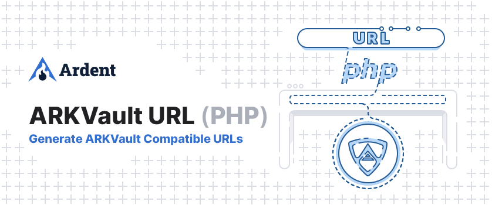

# ARKVault URL

<p align="center">
    
</p>

> A PHP package to generate URLs compatible with ARKVault

## Usage

Install the package in your project

```bash
composer require ardenthq/arkvault-url-php
```

Import the URLBuilder class

```php
use Ardenthq\UrlBuilder\UrlBuilder;
```

Initiate the builder and generate your URL

```php
$builder = new UrlBuilder();

$transferUrl = $builder->generateTransfer('DM7UiH4b2rW2Nv11Wu6ToiZi8MJhGCEWhP');
// > https://app.arkvault.io/#/?method=transfer&recipient=DM7UiH4b2rW2Nv11Wu6ToiZi8MJhGCEWhP&coin=ARK&nethash=6e84d08bd299ed97c212c886c98a57e36545c8f5d645ca7eeae63a8bd62d8988

$transferUrl = $builder->generateTransfer('DM7UiH4b2rW2Nv11Wu6ToiZi8MJhGCEWhP', [
  'amount' => 12.50,
  'memo' => 'My custom message'
]);
// > https://app.arkvault.io/#/?method=transfer&recipient=DM7UiH4b2rW2Nv11Wu6ToiZi8MJhGCEWhP&coin=ARK&nethash=6e84d08bd299ed97c212c886c98a57e36545c8f5d645ca7eeae63a8bd62d8988&amount=12.5&memo=My+custom+message

$voteUrl = $builder->generateVote('benchdark');
// > https://app.arkvault.io/#/?method=vote&nethash=6e84d08bd299ed97c212c886c98a57e36545c8f5d645ca7eeae63a8bd62d8988&delegate=benchdark

$signUrl = $builder->generateMessageSign('message', ['address' => 'address']);
// > https://app.arkvault.io/#/?coin=ARK&nethash=6e84d08bd299ed97c212c886c98a57e36545c8f5d645ca7eeae63a8bd62d8988&method=sign&message=test&address=address

$verifyUrl = $builder->generateMessageVerify(
	message: 'hello world',
	signatory: '025f81956d5826bad7d30daed2b5c8c98e72046c1ec8323da336445476183fb7ca',
	signature: '22f8ef55e8120fbf51e2407c808a1cc98d7ef961646226a3d3fad606437f8ba49ab68dc33c6d4a478f954c72e9bac2b4a4fe48baa70121a311a875dba1527d9d'
);
// > https://app.arkvault.io/#/?coin=ARK&nethash=6e84d08bd299ed97c212c886c98a57e36545c8f5d645ca7eeae63a8bd62d8988&method=verify&message=hello+world&signatory=025f81956d5826bad7d30daed2b5c8c98e72046c1ec8323da336445476183fb7ca&signature=22f8ef55e8120fbf51e2407c808a1cc98d7ef961646226a3d3fad606437f8ba49ab68dc33c6d4a478f954c72e9bac2b4a4fe48baa70121a311a875dba1527d9d
```

For further customizations, you can use the following methods

```php
// Custom coin
$builder->setCoin("Custom"); // Defaults to "ARK"

// Pass a custom nethash for the network
$builder->setNetwork("0123..ef)"; // Defaults to ARK's mainnet nethash

// Or pass the network using the `Networks` enum
// Import enum: `use Ardenthq\UrlBuilder\Enums\Networks;`
$builder->setNetwork(Networks::ARKDevnet);

// Change the base URL by passing it into the constructor
new URLBuilder("https://your-url.com"); // Defaults to app.arkvault.io
```

## Development

### Analyze the code with `phpstan`

```bash
composer analyse
```

### Refactor the code with php `rector`

```bash
composer refactor
```

### Format the code with `php-cs-fixer`

```bash
composer format
```

### Run tests

```bash
composer test
```

## Security

If you discover a security vulnerability within this package, please send an e-mail to security@ardenthq.com. All security vulnerabilities will be promptly addressed.

## Credits

This project exists thanks to all the people who [contribute](../../contributors).

## License

[MIT](LICENSE) © [Ardent](https://ardenthq.com)
